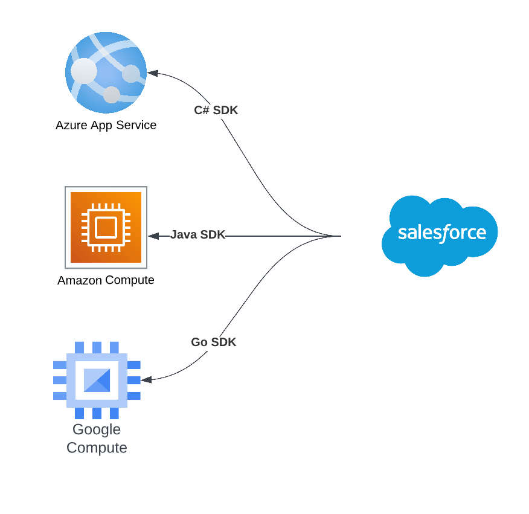

# Salesforce Functions API

**Goal**

Apex Functions support for server SDK developed in  **ANY** programming language hosted in **ANY** infrastructure, be it local or cloud.&#x20;

<figure><figcaption></figcaption></figure>

Develop an open standard so anyone can develop a server SDK on any programming language and deploy it to any cloud provider. This can be open source or commercial.&#x20;


**Salesforce to Provide**&#x20;

* Provide a set of Apex interfaces. Keep them compatible with the current SF Function implementation.&#x20;
* Provide the message structures (JSON Schema) that will be used to communicate between SF Function and the server
* Provide a set of Testing assets to test the implementation to ensure they meet the standards. These will be Apex and also Postman projects.


**Server Side SDK provider to provide at a minimum.**

* Support the Functions messaging standard.&#x20;
* Request-Reply support (1:1)
* Call back support (1:1 and 1:M)
* Ability to perform CRUD on Salesforce object
* Pass the Apex Functions confirmation Test.&#x20;

The client-server communication is based on open standards ([Cloud Events](https://cloudevents.io/)); thus, any Cloud Events client can use the server application you have written. Cloud Events provides SDKs for Go, JavaScript, Java, C#, Ruby, PHP, PowerShell, Rust, and Python.

**Server SDK Setup**

The server should provide an HTTPS endpoint that can accept a POST, and the URI will be /functions.&#x20;









(Need to define a JSON Format)







[**Function Class**](https://developer.salesforce.com/docs/atlas.en-us.apexref.meta/apexref/apex\_class\_functions\_Function.htm#apex\_class\_functions\_Function)\


Use the Function Apex class to access deployed Salesforce Functions and invoke them synchronously or asynchronously.

This is the primary class all users will use. The sample code will look as follows.&#x20;

```apex
public static string FunctionDemo() {
  Function accountFunction = Function.get('MyProject.AccountFunction');
  FunctionInvocation invocation = accountFunction.invoke('{"AccountId":"123"}');
  return invocation.getResponse();     
}
```

Note the line _Function.get('MyProject.AccountFunction');_ The value we are passing _MyProject.AccountFunction._&#x20;

MyProject is the name of the [named credential](https://developer.salesforce.com/docs/atlas.en-us.apexcode.meta/apexcode/apex\_callouts\_named\_credentials.htm) if the URL is set to https://api.apexfunctions.com/ in a named credential called "MyProject" The callout will look like

```apex
HttpRequest req = new HttpRequest();
req.setEndpoint('callout:MyProject/AccountFunction');
req.setMethod('POST');
Http http = new Http();
HTTPResponse res = http.send(req);
System.debug(res.getBody());
```

`AccountFunction` is the name of the function that is passed to the server.

**Request JSON (Work in Progress)**

```json
{
  "userSessionId" : "SESSION_ID_REMOVED",
  "userName" : "apexfunctions@demo.com",
  "type" : "AccountFunction",
  "timeStamp" : "4/29/2023, 11:02:21 AM PDT",
  "specversion" : "1.0",
  "source" : "https://server.develop.my.salesforce.com",
  "orgId" : "00DDo000001AEWSMA5",
  "id" : "01GZ72W7GFRMQDYCHM6ZZ9C0D1",
  "datacontenttype" : "application/json",
  "data_base64" : null,
  "data" : "{\"AccountId\":\"123\"}"
}
```

<table><thead><tr><th width="176">JSON Property</th><th>Description</th></tr></thead><tbody><tr><td>userSessionId</td><td></td></tr><tr><td>userName</td><td></td></tr><tr><td>type</td><td></td></tr><tr><td>timeStamp</td><td></td></tr><tr><td>specversion</td><td></td></tr><tr><td>source</td><td></td></tr><tr><td>orgId</td><td></td></tr><tr><td>id</td><td></td></tr><tr><td>datacontenttype</td><td></td></tr><tr><td>data_base64</td><td>Do we need this ? </td></tr><tr><td>data</td><td></td></tr></tbody></table>

**Response JSON (Work in Progress)**

```json
{
  "userName" : "apexfunctions@demo.com",
  "totalTime" : 123,
  "timeCompleted" : "2023-04-29T18:02:21.598Z",
  "serverName" : "Azure Lambada Server One",
  "source" : "https://server.develop.my.salesforce.com",
  "response" : "{\"AccountId\":\"123\"}",
  "orgId" : "00DDo000001AEWSMA5",
  "invocationStatus" : "SUCCESS",
  "invocation":"01GZ72W7GFRMQDYCHM6ZZ9C0D1",
  "function":"AccountFunction",
  "error" : "
}
```

<table><thead><tr><th width="176">JSON Property</th><th>Description</th></tr></thead><tbody><tr><td>userName</td><td></td></tr><tr><td>totalTime</td><td></td></tr><tr><td>timeCompleted</td><td></td></tr><tr><td>serverName</td><td></td></tr><tr><td>source</td><td></td></tr><tr><td>orgId</td><td></td></tr><tr><td>invocationid</td><td>This should be id but that is  a reserved word in SF</td></tr><tr><td>function</td><td></td></tr><tr><td>error</td><td></td></tr><tr><td>response</td><td></td></tr></tbody></table>


#### Call Backs

SF Function can be invoked asynchronously. For this, the calling Apex Code will implement

* [**FunctionCallback Interface**](https://developer.salesforce.com/docs/atlas.en-us.apexref.meta/apexref/apex\_interface\_functions\_FunctionCallback.htm#apex\_interface\_functions\_FunctionCallback)\
  Represents the callback Salesforce calls when an asynchronous, queued Function invocation has been completed.

The following sample code shows how this is done in Apex

```apex
public static string FunctionCallBackDemo() {
  Function accountFunction = Function.get('MyProject.AccountFunction');
  FunctionInvocation invocation = accountFunction.invoke('{"AccountId":"123"}', new DemoCallBack);
  return invocation.getResponse();     
}

public class DemoCallback
  implements functions.FunctionCallback {
    public void handleResponse(functions.FunctionInvocation result) {
      // Handle the result of function invocation
      String jsonResponse = result.getResponse();
      System.debug('Got response ' + jsonResponse);
      JSONParser parser = JSON.createParser(jsonResponse);
    }
}
```

1:1 Callbacks: These are callbacks when a request is completed

1:N Callbacks: These are callbacks that are made during the execution of a function.


Server side SDK


Salesforce object name

<table><thead><tr><th width="197">Field Name</th><th width="87.33333333333331">Type</th><th>Comment</th></tr></thead><tbody><tr><td></td><td></td><td></td></tr><tr><td>Name</td><td>String</td><td>The ID of the function call</td></tr><tr><td>Status</td><td>String</td><td>ERROR, PENDING, SUCCESS</td></tr><tr><td>Response</td><td>String</td><td>Response as a JSON Striong</td></tr><tr><td>ResponseType</td><td>String</td><td>JSON or Base64</td></tr><tr><td>CallBackClass</td><td>String</td><td>The name of the Apex Callback Class</td></tr></tbody></table>


*


* [**FunctionErrorType Enum**](https://developer.salesforce.com/docs/atlas.en-us.apexref.meta/apexref/apex\_enum\_functions\_FunctionErrorType.htm)\
  Represents the error type of FunctionInvocationError.
* [**FunctionInvocation Interface**](https://developer.salesforce.com/docs/atlas.en-us.apexref.meta/apexref/apex\_interface\_functions\_FunctionInvocation.htm#apex\_interface\_functions\_FunctionInvocation)\
  Use FunctionInvocation to get the status and results of a synchronous or asynchronous Function invocation.
* [**FunctionInvocationError Interface**](https://developer.salesforce.com/docs/atlas.en-us.apexref.meta/apexref/apex\_interface\_functions\_FunctionInvocationError.htm#apex\_interface\_functions\_FunctionInvocationError)\
  Use FunctionInvocationError to get detailed error information about a failed Function invocation.
* [**FunctionInvocationStatus Enum**](https://developer.salesforce.com/docs/atlas.en-us.apexref.meta/apexref/apex\_enum\_functions\_FunctionInvocationStatus.htm)\
  Represents the status of a Function invocation.
* [**FunctionInvokeMock Interface**](https://developer.salesforce.com/docs/atlas.en-us.apexref.meta/apexref/apex\_interface\_functions\_FunctionInvokeMock.htm#apex\_interface\_functions\_FunctionInvokeMock)\
  Use the FunctionInvokeMock interface to mock Salesforce Functions responses during testing.
* [**MockFunctionInvocationFactory Class**](https://developer.salesforce.com/docs/atlas.en-us.apexref.meta/apexref/apex\_class\_functions\_MockFunctionInvocationFactory.htm#apex\_class\_functions\_MockFunctionInvocationFactory)\
  Use the MockFunctionInvocationFactory methods to generate appropriate mock responses for testing Salesforce Functions.
